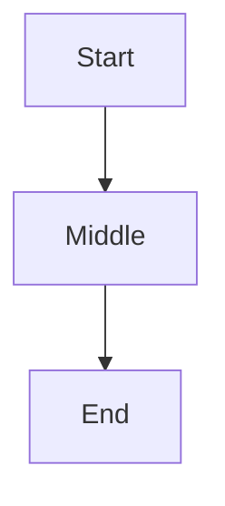

# NOC Documentation — Agent Guidelines

## Toolchain

- **Sphinx** for building the documentation site (getnoc.com) with Material theme 9.7
- mkdocstrings for Python introspection, macros plugin for dynamic content generation, i18n plugin for multi-language support

Configuration: `mkdocs.yml` at project root defines navigation and metadata. **Never edit nav structure manually** without updating `mkdocs.yml` first.

## Documentation Structure — Logical Organization (Not Directory Organization)

**This is the most important convention.** The physical directory layout in `docs/` does NOT reflect the logical documentation organization. Each logical "book" lives as a separate directory with its own `SUMMARY.md` navigation file. The root `mkdocs.yml` collects these into top-level categories:

- **Guides** → Quickstart, community guide, developer guide, translation/contributing guides
- **References** → Profiles, capabilities, alarm classes, event classes, metrics, NBI/DataStream APIs, BI models, ConfDB, scripts reference, model interfaces (every section in this category is its own directory with a `SUMMARY.md`)
- **How-to** → Step-by-step operational guides (deploy NOC, backup, device scanning, MIB importing) (directories named `*-howto/`, each with `index.md` and optional `*.ru.md`)
- **Background** → Conceptual explanations of system concepts (fault management, topology processing, service status monitoring, cards, ETL). Each topic is its own directory.
- **Blog** → Release announcements in `blog/posts/` organized by year

Each book directory follows this skeleton:

```bash
<book-name>/
├── SUMMARY.md          # navigation tree within this book (recommended — reduces mkdocs.yml size and localizes nav)
├── index.md            # home page for this book
└── <page>.md           # individual pages (can also be subdirectories with their own index.md)
```

SUMMARY.md is **recommended, not mandatory**. Every directory without one falls back to flat file discovery. The benefit of SUMMARY.md is two-fold: it keeps the root `mkdocs.yml` uncluttered and localizes navigation definitions to each book's directory. You can skip SUMMARY.md for small docs trees; include it when a category grows beyond 5–10 pages or when the team wants clear ownership of the nav structure.

**Critical rule:** when creating new documentation, determine which book category it belongs to first. Never create a markdown file in a random directory — all new documents MUST go into one of the established books above, or require approval to create an entirely new one.

## Multi-language Support

Every markdown file may have a `.ru.md` counterpart (same filename with `.ru.md` suffix appended). The MkDocs i18n plugin uses `suffix` mode — it automatically pairs `index.md` + `index.ru.md` or `alarm-classes.md` + `alarm-classes.ru.md`.

When adding new documentation:
1. Always create the English version (`*.md`) first
2. Only add the Russian translation if you are fluent — it is optional, not mandatory
3. Do NOT create `.ru.md` files in a random directory; follow the same naming pattern as existing pages in the target book

## Diagrams and Visual Content

**Mermaid diagrams:** When you need to visualize architecture, flows, or relationships inside documentation text, use a fenced Mermaid code block:

````

````

This requires the `pymdownx.superfences` plugin. Always prefer mermaid over other diagram formats when creating new diagrams in docs. If you are unsure if mermaid fits your use case — ask before deciding.

**Screenshots and images:** Screenshots, diagrams, and pictures are allowed in documentation text where they add concrete value that text alone cannot convey (e.g., showing a UI form, a map overlay, or an equipment photo). Before adding any image to docs:

1. **Minimize first.** Compress all raster images to the smallest reasonable file size. Do not include full-resolution photos — screenshots and images must go through lossless/lossy compression before inclusion in version control.
2. **Place images next to the text** that describes them — adjacent paragraphs, same directory or a nearby `assets/` subdirectory relative to the page. Never dump all documentation images into one central folder where the connection between image and description is broken.
3. Keep file sizes modest so they do not inflate the git repository unnecessarily. Prefer lightweight SVG when creating new graphics from scratch; PNG/JPEG are acceptable for screenshots and photos — just minimize them first.

## Writing Documentation — Style Guide Reference

All docs must follow the style guide in `docs/docs-style-guide/`. The four required doc types map to specific writing patterns:

| Type | Purpose | When to write it | Key convention |
|------|---------|------------------|---------------|
| **Tutorial** | step-by-step guided learning (intro/context + tasks) | Teaching a complete workflow from scratch | Start with "why this matters" before tasks |
| **How-to guide** | problem-focused, solution-oriented | User has a specific problem and wants the answer | No conceptual preamble — go straight to solution |
| **Reference** | data dictionary and structured lookups (OIDs, metrics, APIs) | When the user needs exact values/config options | YAML-style config examples; tables for structured data |
| **Explanation** | "why does this work this way?" — pure concept, not how-to | User needs to understand the reasoning behind a design decision | No task steps — just context and reasoning |

## Code Examples in Docs

- Use shell commands for CLI examples: `` ./noc command arg ``
- Include actual configuration snippets (not placeholders) whenever possible
- When referencing NOC config options, use YAML syntax for clarity
- Reference NBI/API endpoints with URL paths like `/api/v1/objects/` rather than full URLs — agents and internal links should resolve these relative to the live site

## Cross-references

- **Internal docs links** → always use relative paths: `../reference/metrics/index.md`
- **External NOC references** → link to the live site (https://getnoc.com/)
- Always verify external links work before merging doc changes — broken nav links or missing target pages will fail CI build

## When to Edit `mkdocs.yml` vs When to Use `SUMMARY.md`

- The root `mkdocs.yml` defines **top-level navigation** categories (Guides, References, Background, etc.) and links each book directory via a single line like `- Guides: guides/`. Modify this only if you are adding/removing top-level nav items.
- The `SUMMARY.md` inside each book directory defines the **internal structure** of that category. This is where you add/reorder sub-pages within a book. You can edit `SUMMARY.md` without touching `mkdocs.yml` for routine doc changes.

## Building & Deploying

```bash
# Serve docs locally (rebuilds on changes)
mkdocs serve

# Build and deploy site to GitHub pages  
mkdocs gh-deploy --strict --force
```

Built output goes to `dist/docs/`. Do not edit files there — they are auto-generated.

## Releases

The `/releases/` directory contains release notes for every NOC version from 0.1 through the latest major. Release notes are structured by generation (e.g., "NOC 24.1 Generation") with sub-pages for each minor release (e.g., `24_1_1.md`). No need to manually create new releases — follow the existing pattern when adding release content.

## Contributing to Docs

Contributors must review these files first:
1. `docs/docs-contributing-guide/index.md` — how to participate in NOC docs
2. `docs/docs-style-guide/` — required formatting conventions (always load this before writing new documentation)
3. `docs/docs-translation-guide/index.md` — when and how translations apply

Do NOT merge doc changes without verifying they follow the style guide. Run `mkdocs serve --strict` locally before committing. Broken nav links or missing target pages will fail CI build.
