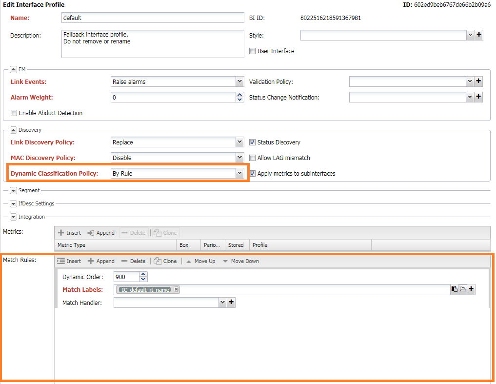

# Dynamic Profile Classification

The most common task when working with NOC is assigning group settings - profiles (`Profile`). 
To automate this process, you can set criteria by which the system will assign the correct profile (`Profile`) upon saving the entity.

## Basic Principles of Operation

* **Automatic profile assignment policy** (`Dynamic Classification Policy`) is added to the profiles.
* A list of rules (`Match Rules`) is added to the profiles (`Profile`).
* If the policy by rule (`By Rules`) is set, the system determines the appropriate profile when the entity is saved.
* The rules are checked in ascending order of the `order` field, ***excluding those where the order is 0***.
* If all `labels` from the rule are present in the entity's effective labels [Labels](../label/index.md), the profile from which the rule matched is considered appropriate.
* If the handler (`handler`) specified in the rules returns `True`, the profile from which the rule matched is considered appropriate.

<!-- prettier-ignore -->
!!! info
    Rules are triggered when an instance is saved (by clicking the **Save** button).

## Profile Assignment Rules Configuration

Profiles (`Profile`) with automatic assignment support have a set of rules (`Match Rules`). The matching criteria are the presence of all specified labels (`Match Labels`) in the entity's effective labels or the `True` result of the handler's operation.

Rule operation is regulated by the policy (`Dynamic Classification Policy`):

* **Disabled** - do not use profile assignment rules.
* **By Rule** - assign a profile according to the rules.

<!-- prettier-ignore -->
!!! info
    With `Disabled` set, automatic profile assignment will not occur.

* **Order** - (`Dynamic Order`) the order in which the criteria are checked (sequential numbering for all profiles). ***If the value is 0, the rule is skipped.***
* **Match Labels** - a set of labels.
* Handler (`Match Handler`) - a reference to the [Handler](../handler/index.md).

## Examples

In rules, you can use any labels, including [Match Labels](../label/index.md#Match Labels), allowing you to combine manually assigned labels with built-in ones.

There are 4 interface profiles in the system:
* `default`. The default interface profile. Should be assigned if none of the others fit.
* `Client Port` - The profile is assigned to all access ports.
* `Trunk Port` - The profile is assigned to all trunk ports.
* `Uplink`. A trunk port whose description contains the words `Uplink`, `UP`, or `UPLINK`.

Conditions based on matching with VLANs will be needed for conditions with `Access Port` and `Trunk Port`. To do this, you need to create a [VC Filter](../vc-filter/index.md).

For the condition with Uplinks, we need to create a [Regex Label](../label/index.md#Regex Labels) `rx_iface_uplink` with the regular expression `(Uplink|UP|UPLINK)` for `Interface Description`:

After creating them, the following labels will be available in the rules: `rx_iface_uplink`, `noc::vcfilter::Any VLAN::untagged::&`, `noc::vcfilter::Any VLAN::tagged::&`

The rule for assigning an interface profile becomes the following set of rules.

| Profile       | Order | Labels                                                  |
| ------------- | ----- | ------------------------------------------------------- |
| `default`     | 999   | `noc::adm_domain::default<`                             |
| `Client Port` | 100   | `noc::vcfilter::Any VLAN::untagged::&`                  |
| `Trunk Port`  | 100   | `noc::vcfilter::Any VLAN::tagged::&`                    |
| `Uplink`      | 90    | `noc::vcfilter::Any VLAN::tagged::&`, `rx_iface_uplink` |
