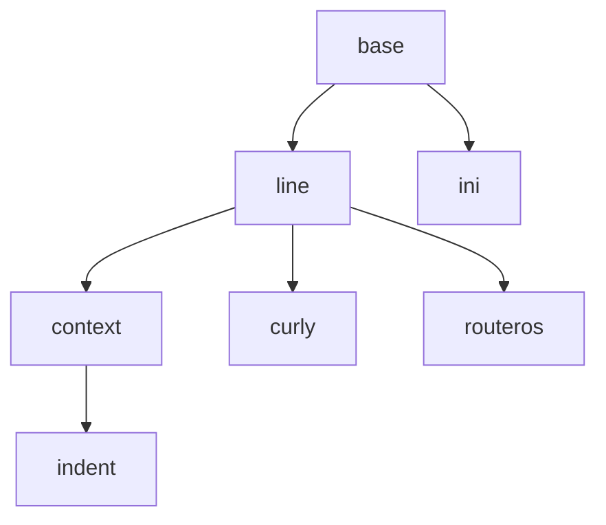

# Config Tokenizer

`Tokenizing` is the process of transforming input device configuration to a stream of the `tokens`. Tokenizer accepts raw config and yields lines of parsed `tokens`. For example, raw config:

```
interface Fa0/1
    description Some interface
    ip address 10.0.0.1 255.255.255.0
```

converted into:

```python
["interface", "Fa0/1"]
["interface", "Fa0/1", "description", "Some", "interface"]
["interface", "Fa0/1", "ip", "address", "10.0.0.1", "255.255.255.0"]
```

Tokenizer must fulfill the following requirements:

* Knows nothing about the meaning of config
* Low memory usage. Output tokens must be yielded whenever ready
* Backward references should be avoided. Tokenizer should operate on the current window just like tape. Forward and backward rewinds must be avoided.
* Output tokens should be grouped and analyzed easy
* Original context should be preserved whenever possible. See at expanding `interface Fa0/1` in the following lines
* Each line of tokens should be further processed independently of each other

It may seem that you need a separate tokenizer for each platform. Luckily, that's not necessary. Though various configuration formats have different meaning, almost all of them maintains some `code style`. Like some languages are indent-based (Python) and some are curly-bracket-based (C, PHP), and some even all-parenthesis (LISP), there are well distinguishable groups of syntaxes. So the real device configurations are grouped in large syntax families with very few exceptions. Usually, you can choose one of the existing tokenizers and apply some configuration rather than create your own tokenizer for a new platform from zero ground.

## Tokenizers

Builtin tokenizers are collected in the `noc.core.confdb.tokenizer` package. Tokenizer classes form an hierarchy:



### line

Basic tokenizer, converting line of config into the line of tokens, separating by spaces and grouping strings together into single tokens and removing comments. Line tokenizer is suitable when each line of configuration is completely self-sufficient and does not depend on previous or following lines.
Though usable by itself, usually used as base class for more advanced tokenizers.

Parameters:

| Name | Description |
| --- | --- |
| `eol` | End-of-line separator |
| `tab_width` | When non-zero replace tabs with `tab_width` spaces |
| `line_comment` | When non-empty sets the sequence which starts whole-line comments. I.e. line containing starting spaces followed with `line_comment` are completely removed from output. (Like `!` in Cisco IOS comments) |
| `inline_comment` | When non-empty sets the sequence which starts inline comments. Unlike the `line_comments` which cover whole line, `inline_comment` yields non-empty parts of lines before `inline_comments` (Like `#` in Python or `//` in C) |
| `keep_indent` | When False removes leading spaces. When True retains leading spaces as single token containing only spaces |
| `string_quote` | When non-empty group tokens together when enclosed in `string_quote`. (Like `"` in Python) |
| `rewrite` | List of tuples of (compiled regular expression, replacement) to fix input formatting glitches |

### context

Descendant of [line](#line) tokenizer. Adds extra ability to determine and stack current contexts from previous lines and apply current context to each output line of tokens automatically.

Accepts all parameters of [line](#line) with extra new parameters:

| Name | Description |
| --- | --- |
| `end_of_context` | When non-empty sets explicit context termination sequence (Like `}` or `end`). When explicit context termination token found at the start of the line, current context closed and removed from stack of context and previous context became current |
| `contexts` | When non-empty sets a list of explicit start of context matching strings. When found from the start of the line the new context is automatically created and pushed to the top of the stack |

### indent

Descendant of [context](#context). Context is detected by start of line indents, like the Python programming language and the Cisco.IOS configs.

Accepts all parameters of [context](#context) but forcefully sets `keep_indent` parameter.

### curly

Descendant of [line](#line) tokenizer. Adds extra ability to determine and stack current contexts from previous lines and apply current context to each output line of tokens automatically. Context are starting with `start_of_context` sequence and closed by `end_of_context` sequence. Unlike [indent](#indent) with their curly braces `{}` which is good choice for [Juniper.JUNOS](../profiles-reference/Juniper/JUNOS.md) configs.

| Name | Description |
| --- | --- |
| `start_of_context` | Explicit start of context sequence (Like `{`) |
| `end_of_context` | Explicit end of context sequence (Like `}`) |

### ini

Basic tokenizer capable of parsing Microsoft Windows INI files. See Python's [ConfigParser](https://docs.python.org/3/library/configparser.html) module for details

### routeros

Descendant of [line](#line) tokenizer adapted to handle [MikroTik.RouterOS](../profiles-reference/MikroTik/RouterOS.md) config

## Profile Integration

<!-- prettier-ignore -->
!!! todo

    Refer to Profile API

Following profile parameters are responsible for tokenizer configuration:

| Parameter | Name |
| --- | --- |
| `config_tokenizer` | String containing name of config tokenizer to use. Refer to [tokenizers](#tokenizers) section for possible values and for recommendations. |
| `config_tokenizer_settings` | Optional dict, containing config tokenizer settings. Refer to [tokenizers](#tokenizers) section for possible values explanation. |
| `get_config_tokenizer(cls, object)` | Classmethod returning actual config tokenizer name and its settings for selected managed object. Should be overriden in profile if tokenizer or settings depends on platform or software version.<br>**Params:**<br>`object` - ManagedObject reference.<br>**Returns:**<br>tuple of (config tokenizer name, config tokenizer settings)<br>Must return (None, None) if platform is not supported. |

## Custom Tokenizer API

Custom tokenizers must be inherited from `noc.core.confdb.tokenizer.base.BaseTokenizer` class
or any of its descendancies. First you must define tokenizer name


```
name
    Unique name of tokenizer.
```

Example:

```python
class MyTokenizer(BaseTokenizer):
    name = "mytokenizer"
```

### `__init__`

Tokenizer configuration passed as parameters to class constructor (`__init__`):

| Name | Description |
| --- | --- |
| data | String containing device configuration |
| param1 | Custom configuration parameter #1 with default value |
| paramN | Custom configuration parameter #N with default value |

It is advised to call superclass' constructor:

```python
class MyTokenizer(BaseTokenizer):
    ...
    def __init__(self, data, param1=default1, ...):
        super(MyTokenizer, self).__init__(data)
```

### `__iter__`

The actual tokenizer must be implemented in `__iter__` method, which implements an iterator yielding tuples of tokens per each line. Tokenizer should analyze `self.data` variable and call `yield` operator per each matched line of tokens
