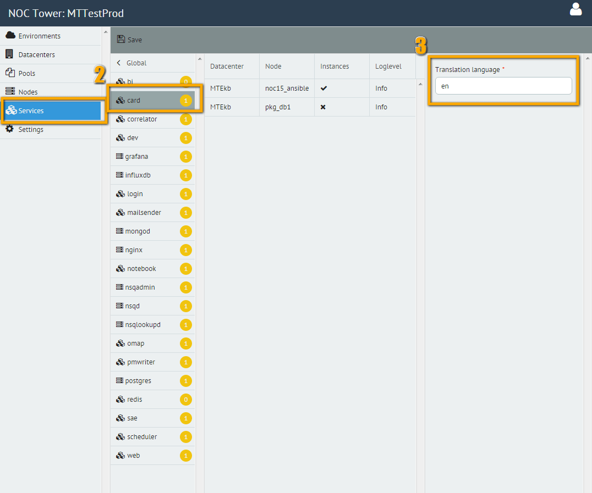
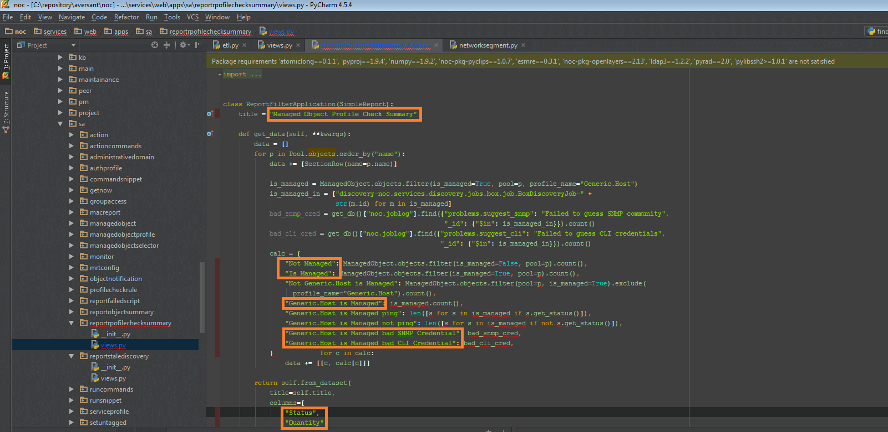
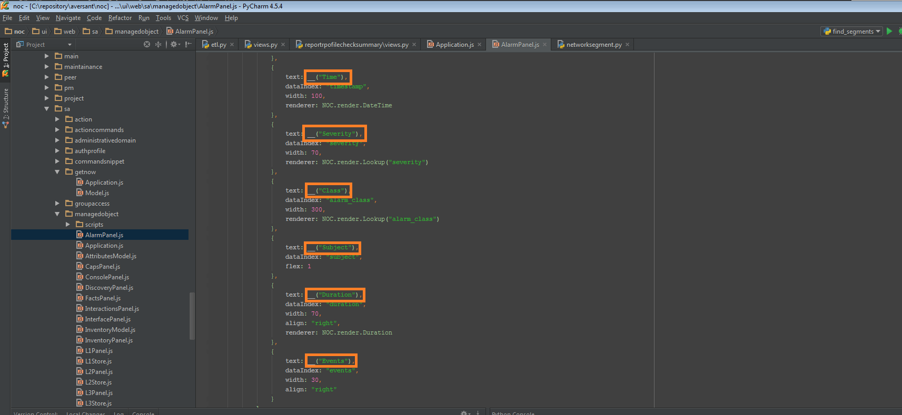
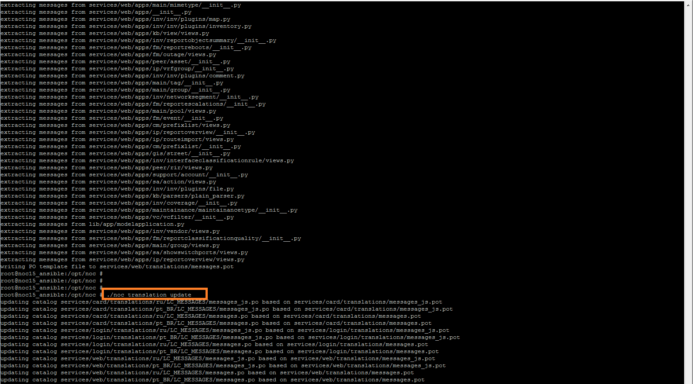
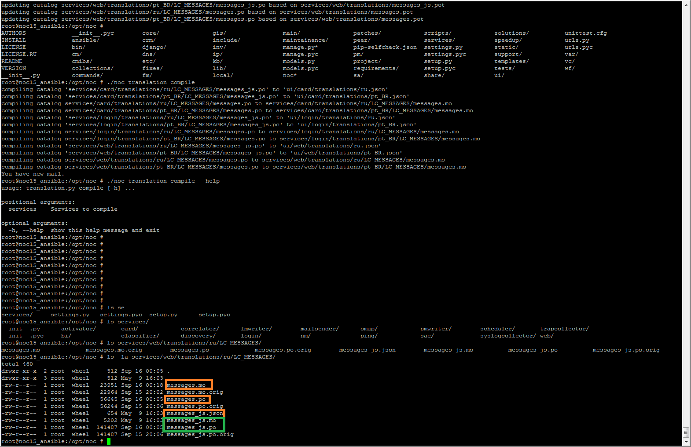

# User Interface Localization Howto

The NOC platform supports user interface localization into various languages. Currently, the following services support localization:

* Web
* Card
* Login

Language selection is done in the service settings through the Tower interface:




After changing the language, you need to deploy with the following options enabled:

* **Install Everything**

or

* **Update config** and **Restart gentle**

## Translation Structure

Localization files are located in the following directories:

* `service/web/translations` - translations for Web
* `service/card/translations` - translations for Card
* `service/login/translations` - translations for Login

The name of the translation directory must be specified in the respective service settings.  
To create your own translations, you can place additional folders next to the main ones.

To work with localization, install the development dependencies:

```shell
pip install -r requirements/dev.txt
```

## Localization Steps

The localization process includes three main steps:

1. Marking translatable phrases in the source code.
2. Extracting and updating translation dictionaries.
3. Compiling translations.

If you need to change an existing translation, you can skip ahead to the section
[creating or updating the translation dictionary](#creating-or-updating-the-translation-dictionary)

### Marking Translatable Phrases

Translatable phrases must be marked in the source code.  
Depending on the file language, different approaches apply:

**Python**

Import the function:

```python
from noc.core.translation import ugettext as _
```

Wrap the translatable string:

```python
_("Text to translate")
```

Example:




**JavaScript**

Use the `__()` function:

```javascript
__("Text to translate")
```

Example:



After marking the strings, commit the changes:

```bash
git commit
```

!!! warning

    the `translation extract` command will not work unless changes are committed.

### Creating or Updating the Translation Dictionary

Extract strings and update the dictionary using the commands:

```bash
./noc translation extract <service>
./noc translation update <service>
```

The `<service>` parameter is optional.  
If omitted, the operation will apply to all services.




After executing the commands, a `.po` file with translatable strings will be created or updated. Example paths:

- `translations/ru/LC_MESSAGES/messages.po` — for Python
- `translations/ru/LC_MESSAGES/messages_js.po` — for JavaScript

You can edit the file in any text editor or in [PoEdit](https://poedit.net/).

```bash
./noc translation edit <service> <lang>
```

— runs the built-in editor (if available on the node).

!!! warning
    
    Make sure you are editing the dictionary for the correct service. You can ignore other services if they haven’t received new strings.

### Compiling Translated Text

After editing, compile the translations:

```bash
./noc translation compile <service>
```


After compilation, you need to restart the relevant service (web, card, login).

### Publishing the Translation

If you need to submit the translation along with other changes, provide the following three files for each modified service:

- `.po` — dictionary
- `.mo` — compiled dictionary
- `messages_js.json` — JavaScript translation



!!! warning
    
    Submit only the changed files.  
    Do not include files where only the date was changed.

## Troubleshooting

**Problem**

Error when running `./noc translation extract`:

```
ImportError: No module named babel.util
```

**Solution**

Install development dependencies:

```bash
pip install -r requirements/dev.txt
```
