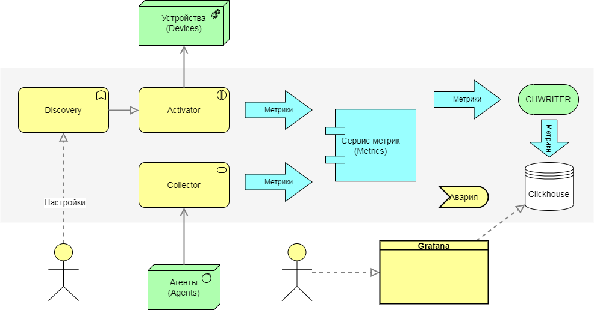
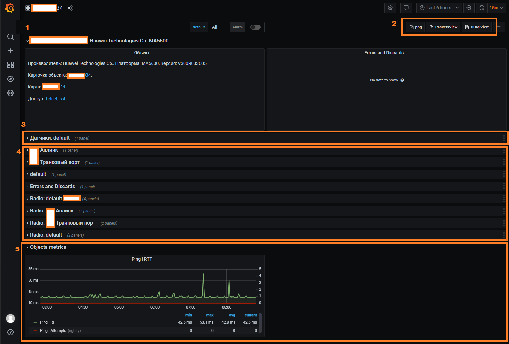
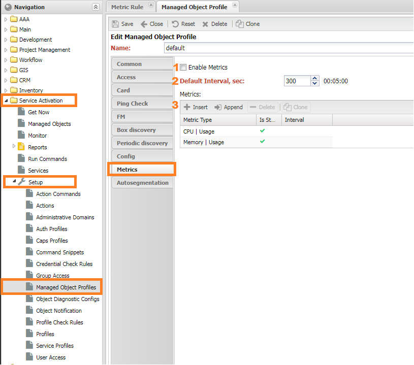
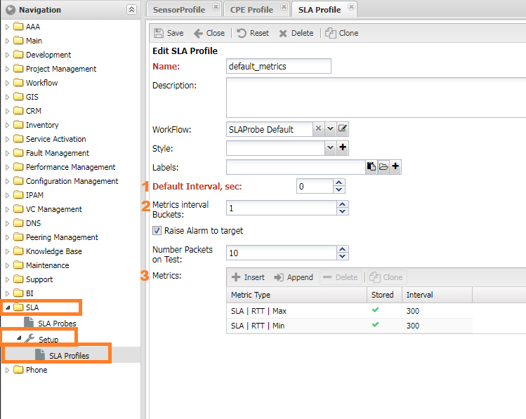
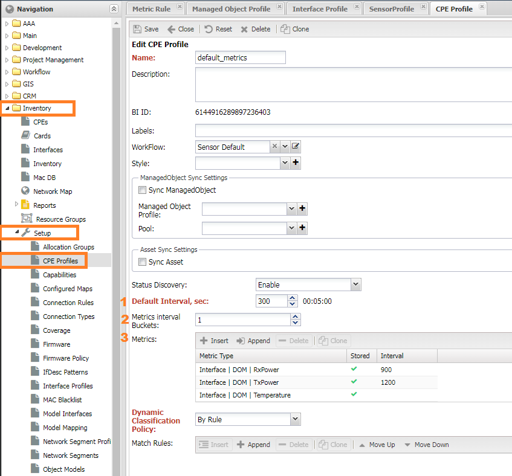
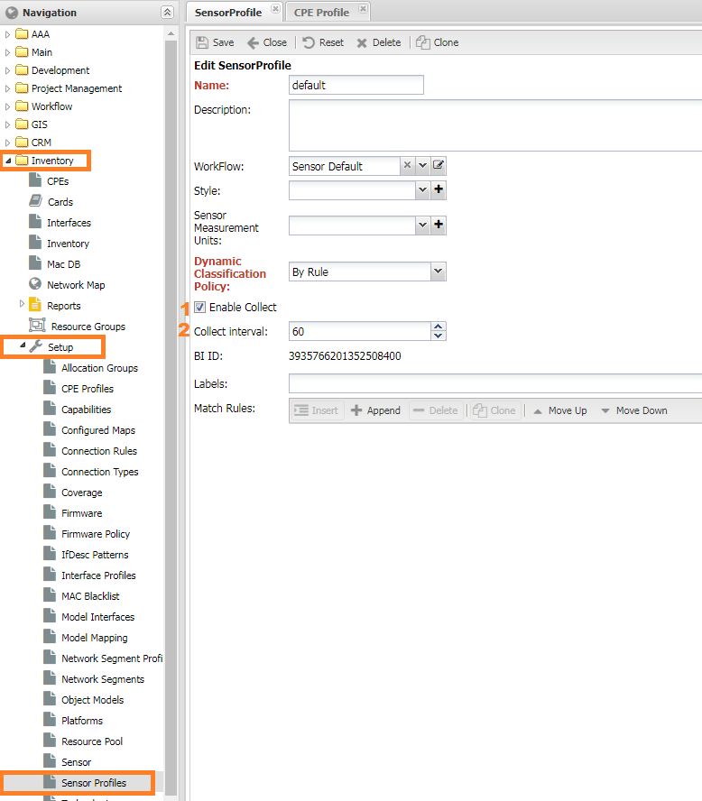
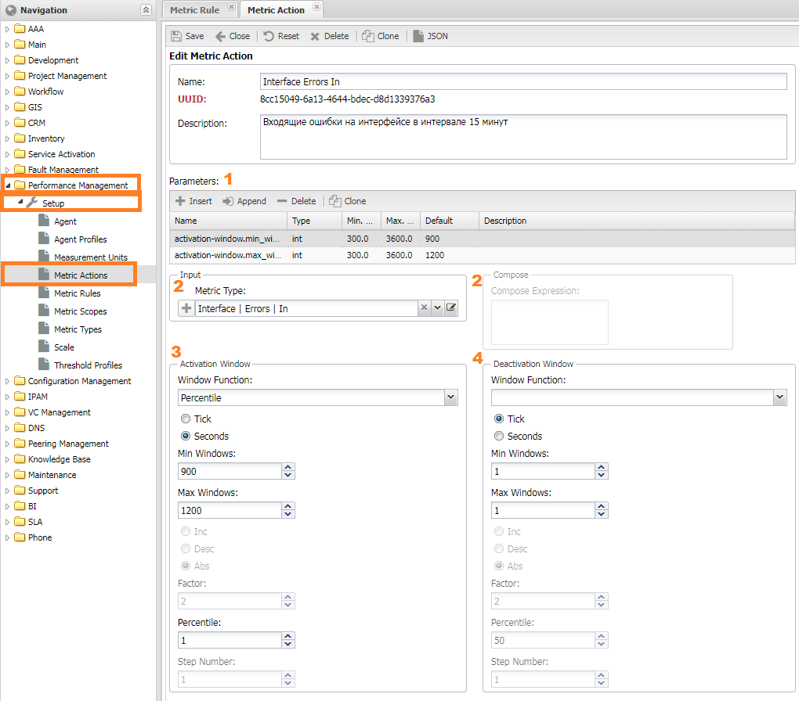
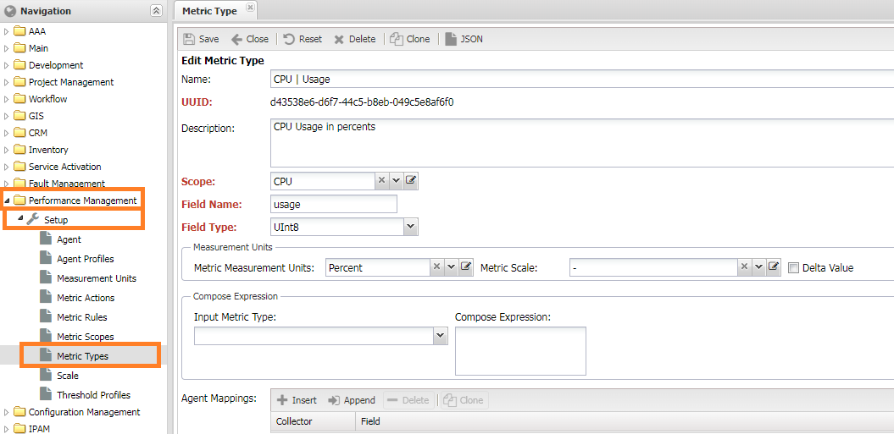
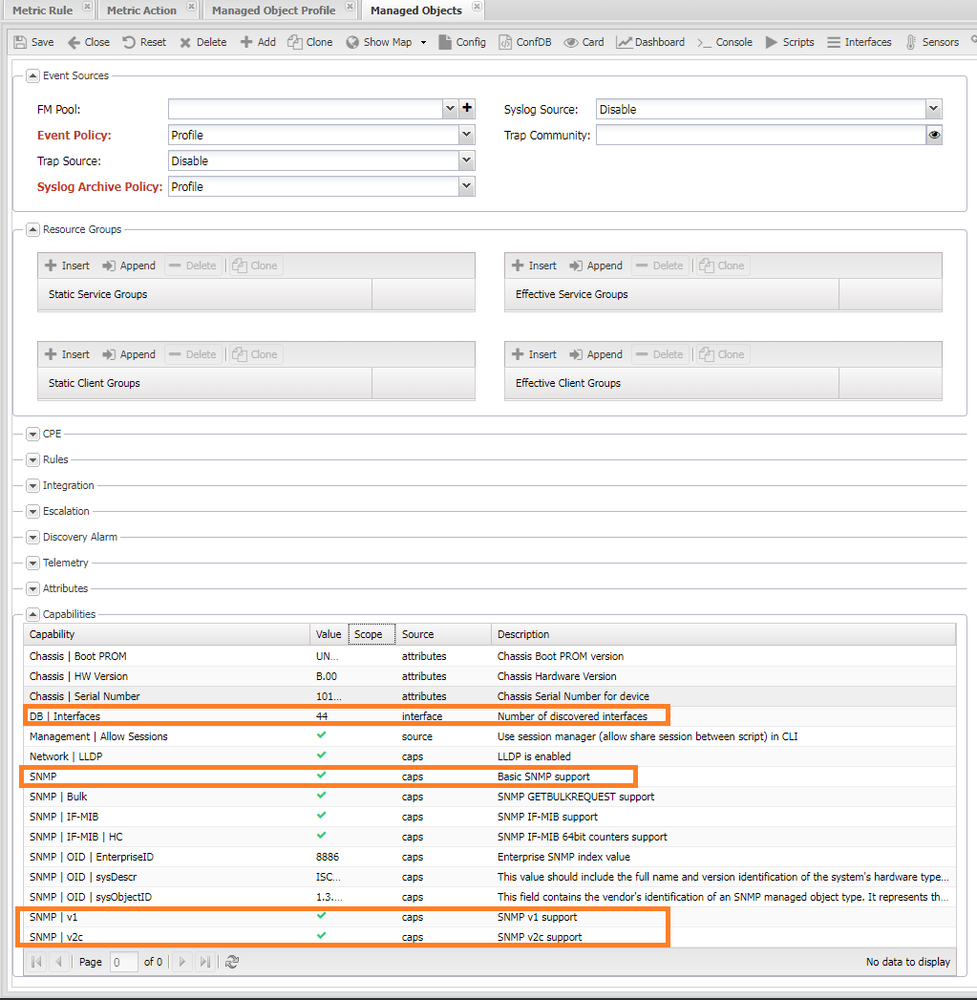

# Performance Management

## Performance Management (PM) Subsystem

The Performance Management (PM) subsystem in NOC is responsible for managing and monitoring metrics. It functions similarly to other systems with some configuration nuances.

### Core Functionality

- Periodically retrieves metrics from network equipment.
- Accepts metrics from external systems.
- Default support for collecting a standardized set of metrics, including IF-MIB, and CPU/Memory metrics for common devices.
- Allows metric collection configurations for device ports, SLA probes, sensors, and OLT PON (for Huawei devices).
- Applies threshold values to metrics to trigger alarms.
- Stores collected metrics in a database (utilizes Clickhouse).
- Provides visualization of metrics on Grafana dashboards.
- Supports report generation based on collected metrics.

### Customization

- Allows the addition of custom metrics for collection.
- Provides the ability to create custom Grafana dashboards.
- Enables the creation of reports and analytics using Clickhouse.

### Limitations

The PM subsystem has certain limitations:

- It does not support scheduling metric collection at specific times (e.g., collecting metrics at a specific day and hour).
- It cannot collect metrics via IPMI.
- Adding metrics collection via an MIB browser is not supported; it requires custom scripting (Python).

Please note that this information serves as an overview of the PM subsystem's capabilities and limitations.

### Key Metrics Terminology

Here are some important terms used when working with metrics in NOC:

- **Metric**: A numerical value describing an object's characteristic.
- **Metric Type**: The name of a metric in NOC (metric settings).
- **Metric Scope**: A set of fields available to describe a metric.
- **Label**: A tag containing information about the metric (metadata).
- **Metric Processing Rule**: A description of what the system should do with a metric, often used for setting thresholds.
- **Threshold**: A numerical value against which a metric is compared. When exceeded, it triggers an alarm.
- **Metric Source**: A record in the system from which a metric is collected. Each source has a unique identifier called `bi_id`. Available sources include:
  - SLA Probe: Utilizes SLA probes on network equipment, such as Cisco SLA-monitor, Juniper RPM, or Huawei NQA.
  - Sensor: A sensor on network equipment.
  - Managed Object: A network device with an IP address, such as a switch or router.
  - CPE (Customer Premises Equipment): Devices that work with a controller, including IP phones, ONTs, and WiFi APs.
  - Agent: Gathers information from servers.
- **BI ID**: The identifier of the metric source in the metric storage.

In the context of metric collection, metrics are sometimes categorized as scalar or vector:

- **Scalar Metrics**: When one *name* corresponds to **one** value. For example, if a device has one temperature sensor, the metric "Temperature" will have one value, indicating the reading of that sensor.
- **Vector Metrics**: When one *name* corresponds to **more than one** metric value. For example, the metric "Number of Incoming Packets" has as many values as there are interfaces on a device. In the previous case, if there are multiple temperature sensors, the Temperature metric will return values like "Temperature of Sensor 1," "Temperature of Sensor 2," and so on. Tags are used to differentiate metrics.

This terminology is essential for working with metrics effectively in NOC.

## Architecture and Components

Architecturally, the PM (Performance Management) system in NOC consists of the following services:

### Collector
- Responsible for collecting metrics.
- Components include:
    - Activator + Discovery: Collects metrics from network devices (Managed Objects).
    - MetricCollector: Provides an API for receiving metrics from other systems.
    - Agent: Collects metrics from hosts.

### Metric Service
- Responsible for calculating metric values and applying threshold rules.

### Database Writer (CHWriter)
- Writes metrics to the database.

### Database (ClickHouse)
- Stores metrics.

### Grafana

- Displays collected metrics on graphs.

Let's delve into each component and describe its role in the process of working with metrics.

### Activator + Metric Discovery

The Activator interacts with network equipment through the Discovery service. Metric collection is handled by the 'get_metrics' script with a parameter that specifies the list of metrics to collect. Out of the box, this script supports the standard SNMP metric set, with additional metrics described in the Profile.

#### Supported Metrics:

- IF-MIB: All interface metrics
- sysUptime: Uptime
- CPU | Usage, Memory | Usage: Metrics for specific profiles

Metrics can be described in two ways:

1. In the 'snmp_metrics' folder of the profile, where metric collection configurations are stored as JSON files.
2. In the 'get_metrics' script of the profile, where collection is implemented using Python code. The base 'get_metrics' script is located in 'sa/profiles/Generic'.

Please note that metric collection configurations are generated on the Discovery side and passed to the Activator.

### Metric Service

The Metric Service processes incoming metrics in the following steps:

1. Checks incoming metrics for compliance with MetricScope.
2. Normalizes received values and calculates counter values.
3. Applies rules and calculates thresholds.
4. Sends metrics for writing to storage.

### CHWriter

CHWriter is responsible for writing metrics to their respective tables, with table names described in MetricScope.

### ClickHouse (CH)

The ClickHouse database by Yandex serves as the storage for metrics.
### Grafana

Grafana is used to visualize collected metrics in the form of graphs. It utilizes the `clickhouse-plugin` to interact with the storage. To access the graphs, navigate to the device view and click the "Graphs" button. This will open a general dashboard for the device:

The device dashboard is divided into several areas:

* **(1)** Device Card - Provides brief information about the device and buttons to navigate to other dashboards.
* **(3)** Sensors Area - Displays graphs for sensors on the device.
* **(4)** Interfaces (Ports) Area - Shows graphs of interface (port) utilization.
* **(5)** Object Metrics - Displays graphs of metrics added in the object's settings (Object Profile).

Additional dashboards are accessible via links in the top-right corner **(2)**:

* Packet Interface Utilization Graphs.
* Optical Metrics (DOM) Graphs.

Please note that if a panel is missing for any interface, you should ensure that metric collection is enabled for that interface.

## Metric Collection Configuration

To initiate metric collection, you must enable polling for metrics. In the *Managed Object Profile*, navigate to the *Metrics* tab, and check the box for "Enabled Metrics". This action will trigger the collection of metrics assigned to the device.

!!! note

    Ensure that the system has successful access to the device for metric collection to work.

Metrics for collection are assigned in *group settings*, known as *Profiles*. On the configuration form, you will find a metrics panel with the following settings:

* **Default Interval** (`Metric Default Interval`) - The interval at which metrics are collected. If set to 0, it uses the interval from the [Managed Object Profile](../../concepts/managed-object-profile/index.md) of the device.
* **Maximum Interval Buckets** (`Metrics Interval Buckets`) - The number of nested collection intervals. For more details, see [Metrics Collection Sharding](#metrics-collection-sharding).
* Metrics for Collection:
    * **Metric Type** (`MetricType`) - The type of metric to collect. Support should be available from the [SA Profile](../../../dev/sa/sa-profiles.md).
    * **Store** (`Is Stored`) - Determines whether the metric is saved in the database.
    * **Interval** (`Interval`) - An individual collection interval that overrides the *default interval*.

For device metrics assigned in the *Managed Object Profile*, a graph is automatically added to the [Grafana](#Grafana) dashboard.

## Object Profile

In the group settings of an object (`Managed Object Profile`), you can add metrics for the device. These metrics can be any type except for interface metrics and SLA metrics, which are configured in their respective profiles. To access the Object Profile, go to `Service Activation -> Setup -> Managed Object Profile -> Metrics` and navigate to the Metrics tab.

Setting **(1)** `enable_metric` enables metric polling for the device. If this setting is not enabled, metrics for the device will not be collected.

### Interface Profile

In the group settings of an interface [Interface Profile](../concepts/interface-profile/index.md), you can add metrics that are collected from the interface. For ease of identification, these metrics usually start with `Interface | XXX`. These settings are located under `Inventory -> Setup -> Interface Profiles`. The `Metric Collected Policy` configuration includes the following options:

* Enable
* Disable if Admin Down
* Disable if Oper Down

Interfaces can be found under `Service Activation -> Managed Object -> <ManagedObject> -> Interfaces`. To save time, it is recommended to use the automatic profile assignment mechanism: [Dynamic Classification Policy](../concepts/dynamic-classification-policy/index.md).

## SLA Profile

In the group settings of an SLA probe, you can add metrics specific to SLA (Service Level Agreement) measurements. These metrics are usually identified with names starting with `SLA | XXX`. You can find these settings under `SLA -> Setup -> SLA Profiles`.

### CPE Profile

In the group settings of a CPE (Customer Premises Equipment), you can add metrics for collecting data from CPE devices. These metrics are similar to device metrics but are collected from the CPE controller (`Managed Object`). You can access these settings under `Inventory -> Setup -> CPE Profiles`.

### Sensor Profile

Since sensors typically collect only one metric, which is `Sensor Value`, there is no specific panel for metrics. Instead, you have the setting **(1)** *Enable collect* to enable or disable metric collection. These settings can be found under `Inventory -> Setup -> Sensor Profiles`.

## Interval Sharding for Metrics Collection

In situations where there are a large number of metric sources on a single device, such as numerous SLA probes or CPEs on a controller, metric collection may exceed the specified interval. To address this, you can increase the collection interval for certain metrics. For example, you might set the SLA metrics collection interval to 15 minutes instead of the default 5 minutes. However, this adjustment may still not fit within their specified intervals.

To avoid this issue, the system provides a mechanism to split metric sources into subintervals, allowing the collection to be spread across the full interval without affecting other metrics.

You can control this mechanism using the setting **Maximum Interval Buckets**, where you specify the number of available subintervals:

* 0 - The number of subintervals is calculated automatically.
* 1 - Disable interval sharding, and only 1 subinterval is available.
* 2 and greater - Manually set the number of subintervals.

This mechanism is supported for both SLA and CPE metrics.

## Configuring Thresholds (Metric Rules)

Thresholds are configured in *Performance Management -> Setup -> Metric Rules*. It is a list of actions for metrics and conditions:

* **Enabled** (`Active`) - whether the rule is active.
* **Actions** (`Actions`) - a list of actions to take when conditions are met.
    * `MetricAction` - manipulation with the metric (see the next chapter). When choosing transformations, the `Metric Type` is taken into account.
    * Metric Type (`MetricType`) - the type of the metric.
    * Thresholds (`Thresholds`) - a list of thresholds; an alarm is raised when exceeded. If the alarm class is not specified, the default one is used.
    * `Action Param` - settings for `MetricAction`.
* **Trigger Conditions** (`Match Condition`) - a set of labels that, when present, cause the rule to be applied to the metric.

When specifying a *transformation* (`Metric Action`), the *metric type* (`Metric Type`) is not considered, and thresholds are applied to the result of the transformation. To change the *severity of the alarm* (`severity`), use labels (`Labels`) in accordance with the rules (`Alarm Rules`).

### Metric Action

For complex manipulations with metrics, the `MetricAction` is available, which allows:

* Using windows
* Applying functions
* Calculating metric values through formulas

You can find these actions in *Performance Management -> Setup -> Metric Action*. The metric processing process looks as follows:

Metrics marked as **(2)** `Input` are processed as follows:

* **(3,4)** **Activation/Deactivation Window** - window functions for values. Settings include:
    * Window Function and its parameters
        * `Sum Step`
        * `Percentile`
        * `Mean`
        * `Exp decay`
        * `Nth`
    * Window Type - the principle of determining the window size
        * `Tick` - the number of values in the window
        * `Seconds` - the time of the first value
    * `Min Window` - the minimum window size at which the window function calculation begins. For `Tick`, it is the number of measurements, for `Seconds`, it is the seconds from the last value.
    * `Max Window` - the maximum window size, values above it are discarded.
    * Window function parameters (depend on the selected function).
* **Activation/Deactivation function** - an [activation function](https://en.wikipedia.org/wiki/Activation_function) that takes the metric value as input and outputs one or zero.
    * `SoftPlus`
    * `Relu`, `Rectifier`
    * `Indicator`
    * `Logistic`
* **Compose Metric** - stores the metric in the database, requiring a filled `MetricType`.
* **Alarm** - raises an alarm, requiring a filled `Alarm Class`.

## Adding Custom Metrics

Adding a new metric involves two steps:

1. Adding the metric's name to the system as a [Metric Type](../reference/metrics/types/index.md).
2. Adding the metric collection in an [SA Profile](../profiles-reference/index.md).

!!! note

    If the metric name already exists (e.g., `CPU | Usage`) but collection is not implemented, you need to modify the profile.

### Adding a Metric Name (Metric Type)

To add a metric name (Metric Type), go to *Performance Management -> Setup -> Metric Types*. To create a new metric name, fill in the following settings:

* **Metric Scope** - the table containing the metric.
* **Field Name** - the column name with the metric in the Metric Scope table.
* **Field Type** - the column type with the metric in the Metric Scope table.
* **Measurement Units**
    * *Metric Measurement Units* - the measurement unit of the metric (default is `Scalar`).
    * *Metric Scale* - the multiplier for the measurement unit (default is `1`).
* **Compose Expression** - settings for calculated metrics.
    * *Input Metrics*
    * *Expression*
* **Delta Value** - Conversion of the value into `Delta`, the difference between the current and last values.

!!! attention

    After adding the Metric Type, you need to restart the `Metric Type` service.

## Implementing Metric Collection in a Profile

There are two ways to add a metric to a profile:

1. Add configuration for collection: located in the `snmp_metrics` folder.
2. Describe a collection function in the `get_metrics` script of the profile.

Each of these methods is described in detail in the documentation.

## Debugging Metric Collection (Or When Things Go Wrong)

The process of metric collection can be visualized as follows: `Settings -> Discovery -> Activator -> Metrics -> CHWriter -> Grafana`. The final result is the display of the metric on a [Grafana dashboard](index.md#Grafana). If there are issues with metric collection, you might encounter a lack of graphs or graph panels.

!!! attention

    The Ping/RTT graph can be ignored since it is generated separately by the pinger.

You can consider two scenarios:

1. Graph panels are present, but they display `No data`.
2. Graph panels are missing entirely.

## Missing Graph Panels

When you add a metric to an Object Profile, a graph panel for that metric is automatically added. Graphs for interfaces display only load and status metrics, while packet metrics and DOM metrics are available on a separate dashboard.

If there's no graph panel for an interface, it indicates that metric collection is disabled in the Interface Profile.

## No Data in Graphs

If a panel is present but displays "No data," it means there's an issue with data collection. To diagnose the problem, you should go through the stages of metric collection and check the correctness of each step.

#### Checking Metric Collection

Metric collection is handled by Discovery, and its logs are available on the problem device's form: `Service Activation -> Managed Object -> Discovery -> Interval`. In the log, you should find lines like "Collected metrics: 25" with the current timestamp (not exceeding the collection interval), where "25" represents the number of collected metrics from the device. If the number of metrics is greater than 0, it means that collection is working correctly, and the issue may lie in the next stage.

If the number of metrics is 0 or the entry is missing, you need to check device accessibility and the correctness of the settings. Additional information may be provided by the following log entries:

- "`|metrics]  Collecting metrics`" indicates that the metrics retrieval process has started. If this line is missing, you need to activate metric collection in the Managed Object Profile. Refer to the "Setting Metrics" section for details.
- "`|metrics]  No metrics found`" in the log means that metrics were not read from the device. Proceed to check device accessibility.
- "`|metrics]  Interface metrics are not configured. Skipping`" suggests that you need to check if metrics are assigned to the Interface Profile and if profiles are linked to interfaces.
- "`|metrics]  SLA not configured, skipping SLA metrics`" pertains to collecting SLA metrics. You should review the settings for collecting SLA metrics.

!!! note

    For additional information on the operation of Discovery, you can run it in debug mode using `./noc discovery --debug run interval MONAME`. The collected metrics will be displayed at the end of the output.

#### Checking Device Accessibility

To collect metrics, the system must successfully poll the device, retrieve its version, platform information, and interfaces (Interfaces). Interfaces should also have their indexes (ifindex) collected. You can verify this through the following menu items:

1. Diagnostics (`CLI/SNMP`) - They should be in normal condition (green).
2. Capabilities - Located at the bottom of the Managed Object form. It should look as shown in the screenshot, with green checkmarks next to SNMP, SNMP | v1, or SNMP | v2.
3. Gathered interfaces with indexes. You can check this on the *Interfaces* tab.

#### Checking the Metrics Service

You can verify the operability of the Metrics service through the log: `/var/log/noc/metrics-0*.log`. In a functioning service, you'll find entries like `[noc.services.metrics.changelog] Compacted to 8 records (90459568 bytes). 0.06 ratio`.

Entries like `All slots are busy, waiting` indicate that the service is waiting for free slots. If you find this entry in all running services, you should check the configuration of the number of services in your deployment.

#### Checking Metric Storage (CHWriter)

To check if metrics are being written to the database, you should find entries in the CHWriter log (`/var/log/noc/chwriter-00.log`) like:

